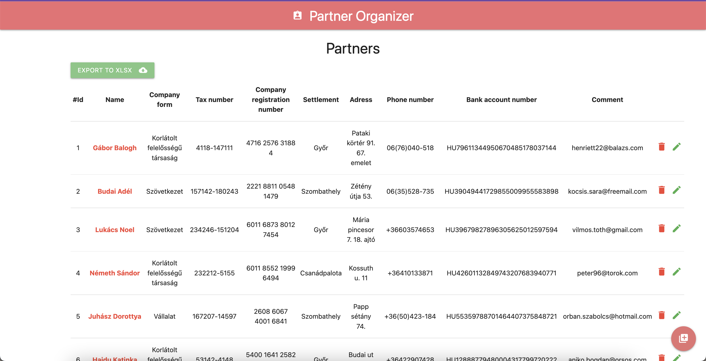

# Project details

Simple application with a separate backend and frontend was created for capturing and editing partner data.

## Backend

REST API using Node.js based on SQLite3 database.

##### Tech stacks
- Node.js
- Express.js
- Knex.js
- SQLite3 database

##### Setup
To run this project, install it locally using npm:
(Creating database tables and seed with dummy data is only needed if you will get a blank database for testing or need to get dummy data after database rollback.)

```
$ cd ../backend
$ npm install
$ npx knex migrate:latest
$ npx knex seed:make seed_companyforms.js
$ npx knex seed:make seed_settlements.js
$ npx knex seed:make seed_partners.js
$ yarn start or yarn server
```


```sh
localhost:1550/api
```

CRUD API endpoints:
Partners API endpoints: /partners
Settlements API endpoints: /settlements
Company forms API endpoints: /companyforms

## Frontend

Client side web interface with React.js and MaterializeCSS.



##### Tech stacks
- React.js
- React-Redux.js.
- MaterializeCSS

##### Setup
To run this project, install it locally using npm:

```
$ cd ../frontend
$ npm install
$ yarn start
```

```sh
localhost:3000
```

------------


##### Todo
- Write API Documentation
- UI Redesign (with Bootstrap v.5)
- Server side search endpoint
- Client side filter and sorting
- Add Company forms option
- implement feature for the "GroupBySettlements" and "GroupByCompanyforms" endpoints
- Write API Documentation with Swagger
- Write API endpoint tests
- Deploy backend to Heroku
- Frontend to Netlify